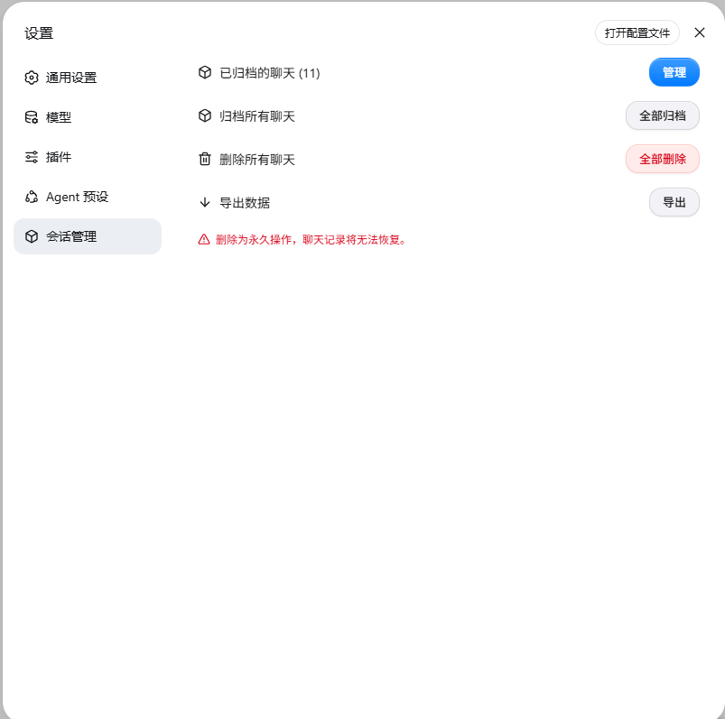

# dsh-session-management · Session Management for DSH

English | [中文](README.md)



dsh-session-management is a session management plugin for [DeepSeek Harness](https://github.com/deepseek-ai/dsh) (DSH) Web: manage chat sessions from the Settings panel — archive, unarchive, **truly delete local chat records**, and export data. The UI follows a restrained Apple/macOS visual style and is fully bilingual (follows the DSH locale setting).


## Features

- **Archived chats management**: click "Manage" to open the management dialog
  - Two grouping views: **by workspace** / **by month** (`August 2026`, `July 2026`...)
  - Sort by created / updated date, ascending / descending
  - Group collapse / expand all / collapse all
  - Per-group batch actions: unarchive this group, **delete the archived chats of this group** (only the group's archived sessions are affected)
- **Archive all chats**: archive everything at once (records are kept, only hidden from the list)
- **Delete all chats**: truly delete all local chat records (running sessions are skipped)
- **Export data**: official-format ZIP export (session log `session.jsonl` + subagents + media attachments)
- **Bilingual UI**: switches instantly with Settings > General > Language

## Installation

DSH plugins mount through a **profile** (`dsh web` uses the `web` profile). **Restart `dsh web`** after installing.

### Option 1: from npm (recommended)

The plugin is published to npm as `dsh-session-management` — install it with one command:

```sh
dsh plugin --profile web add dsh-session-management
```

After installing, restart `dsh web` and open Settings to find the "Session Manager" entry. Pin the version as needed; upgrade with `dsh plugin --profile web update dsh-session-management`.

### Option 2: from GitHub

```sh
git clone https://github.com/cokiscarazo-rgb/dsh-session-management.git
cd dsh-session-management

# Windows (PowerShell)
powershell -ExecutionPolicy Bypass -File scripts/install.ps1

# macOS / Linux
bash scripts/install.sh
```

The installer is idempotent and does two things:

1. Copies the package into `$DSH_HOME/profiles/node_modules/dsh-session-management/`
2. Registers the loader entry in `$DSH_HOME/profiles/web/cordis.patch.yml`:

```yaml
- insert:
    - id: dsh-session-management
      name: dsh-session-management
```

### Manual installation

If the scripts are not applicable, do the two steps above by hand: place `lib/` and `package.json` under `$DSH_HOME/profiles/node_modules/dsh-session-management/`, and append the insert entry to `$DSH_HOME/profiles/web/cordis.patch.yml`.

## Usage

1. Restart `dsh web`, then open **Settings**
2. The sidebar shows a "**Session Manager**" entry
3. Use it to manage archived chats, archive all, delete all, or export data

## Uninstall

```sh
rm -rf ~/.dsh/profiles/node_modules/dsh-session-management
```

Also remove the corresponding insert entry from `$DSH_HOME/profiles/web/cordis.patch.yml`, then restart `dsh web`.

## How it works & limitations

- **Archive**: uses the official `workspaceRegistry.archiveSession` API; the archive set is persisted in the workspace domain and synced to clients through the official frame mechanism. **Unarchive** is not provided by the official API, so the plugin updates the workspace domain archive set directly (the host broadcasts the change through `domain/changed`).
- **Delete = truly delete**: locates the session log files (`session.jsonl` / `session.jsonl.zstd`, including the twin compressed file) and removes them via the system command; then cleans up workspace accounting and archive marks; the search index is reconciled automatically by the official SQLite backend.
- **Export**: reuses the official `/api/session.export` endpoint, downloading one ZIP per root session (`dsh-session-<id>.zip`), byte-compatible with the official format.
- **Limitations**:
  - Running sessions are refused for deletion (to avoid logs being rewritten);
  - Image attachments (content-addressed storage, possibly shared across sessions) are not removed with a session;
  - Subagent sessions are independent records; deleting a parent session does not cascade (they can be deleted individually).

## License

[MIT](LICENSE) © cokiscarazo-rgb

## Credits

Installation mechanics and documentation structure reference [dsh-web-ui](https://github.com/zhu1090093659/dsh-web-ui); the UI follows its [Pinguo/Apple design system](https://github.com/zhu1090093659/dsh-web-ui).
